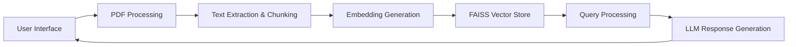

# DeepDocDive: Intelligent PDF Chat Assistant


DeepDocDive is an intelligent conversational assistant that allows you to upload PDF documents and chat with their content using Retrieval-Augmented Generation (RAG) technology. Experience lightning-fast document conversations powered by Groq's ultra-fast inference engine.


## Key Features ✨

- **Natural PDF Conversations**: Chat with your documents like you would with a human expert
- **Multi-Document Support**: Process and query multiple PDFs simultaneously
- **Context-Aware Responses**: Maintains conversation history for coherent follow-ups
- **Session Management**: Save and resume conversations with unique session IDs
- **Lightning-Fast Responses**: Powered by Groq's high-speed inference engine
- **Privacy-Focused**: Your documents never leave your session
- **Easy Setup**: No complex configuration required

## Live Demo

Experience DeepDocDive immediately:  
👉 [https://deepdocdive.streamlit.app](https://deepdocdive.streamlit.app)

## Tech Stack 🧩

| Component              | Technology                |
|------------------------|---------------------------|
| **Frontend**           | Streamlit                 |
| **LLM**                | Groq API (Gemma2-9b-It)  |
| **Embeddings**         | Hugging Face (MiniLM-L6) |
| **Vector Store**       | FAISS (Facebook AI)      |
| **Text Processing**    | LangChain                |
| **PDF Handling**       | PyPDF                    |
| **Deployment**         | Streamlit Cloud          |

## How It Works



1. **Upload PDFs**: Provide one or more PDF documents
2. **Process Content**: The system extracts and indexes your document content
3. **Ask Questions**: Ask natural language questions about your documents
4. **Get Answers**: Receive accurate, context-aware responses
5. **Continue Conversation**: Ask follow-up questions with full context

## Getting Started

### Prerequisites
- Python 3.10+
- Free Groq API key from [console.groq.com](https://console.groq.com)

### Local Installation
1. Clone the repository:
```bash
git clone https://github.com/TANISHQgarg60/RAGPilot.git
cd RAGPilot
```

2. Install dependencies:
```bash
pip install -r requirements.txt
```

3. Run the application:
```bash
streamlit run streamlit_app.py
```

## Usage Guide

1. Visit the [live app](https://deepdocdive.streamlit.app) or run locally
2. Enter your Groq API key in the sidebar
3. Upload one or more PDF documents
4. Click "Process PDFs" to build the knowledge base
5. Start chatting with your documents!

## Project Structure

```
RAGPilot/
├── streamlit_app.py          # Main application code
├── requirements.txt          # Dependencies
├── .gitignore                # Git ignore rules
├── README.md                 # Project documentation
└── assets/                   # For demo images/GIFs (optional)
```

## Why Choose DeepDocDive?

- **No Installation Needed**: Fully web-based solution
- **Enterprise-Ready**: Handles complex documents with ease
- **Time-Saving**: Instantly extract insights from lengthy PDFs
- **Secure**: No document storage - your data stays private
- **Free to Use**: Only requires a free Groq API key
- **No Protobuf Issues**: FAISS vector store avoids common compatibility problems

## Contributing

We welcome contributions! To get started:
1. Fork the repository
2. Create a feature branch (`git checkout -b feature/improvement`)
3. Commit your changes (`git commit -am 'Add new feature'`)
4. Push to the branch (`git push origin feature/improvement`)
5. Open a pull request

## License

This project is licensed under the MIT License - see the [LICENSE](LICENSE) file for details.

---

**Experience document intelligence today: [https://deepdocdive.streamlit.app](https://deepdocdive.streamlit.app)**
